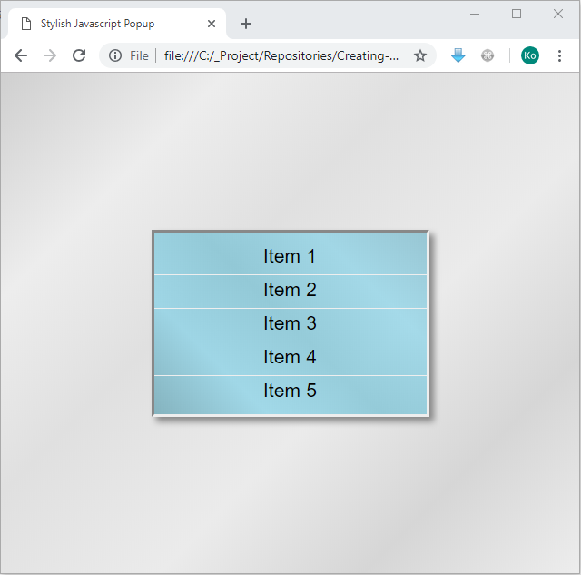
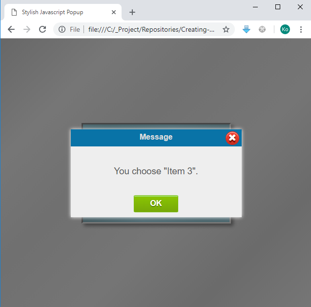

# Creating Stylish Javascript Popup
This project is to demonstrate how to crate stylish popup using Javscript, jQuery and React libraries. 
I will designed a popup that guarantee to compatible across any type and size of devices with modern browsers. 
You will see extensive features of CSS3 and power of jQuery selectors in this project. 
This project will also make use of custom HTML attribute to make the script more elegant and simpler.

#### Output of the Project

The primary screen of project.



The stylish popup.



#### Creating the Html File

Create the _**index.html**_ file in the root folder and add two &lt;div&gt; containers 
named _**_maincontainer**_ and _**_popupcontainer**_ . At the head section it will require to include 
jQuery, React and our own script files and css files. That's all for Html file and the rest will handle 
by javascript and css.

```JAVASCRIPT
<!DOCTYPE html>

<html xmlns="http://www.w3.org/1999/xhtml">
<head> 
	<!-- This Project Compatible with all modern browsers and devices including mobile phone and tablets -->

	<title>
	Stylish Javascript Popup
	</title>
    
	<script src="https://unpkg.com/react@16/umd/react.development.js"></script>
	<script src="https://unpkg.com/react-dom@16/umd/react-dom.development.js"></script>
	<script src="https://cdnjs.cloudflare.com/ajax/libs/jquery/3.3.1/jquery.min.js"></script>
	<link rel="stylesheet" href="css/stylesheet.css" type="text/css"/>
	<script src="js/script.js"></script>    
</head>

<body>
	
	<!--  Container Control for Primary Components -->
	<div class ="maincontainer" id="_maincontainer">
	</div>

	<!--  Container Control for Popup -->
	<div class ="popupncontainer" id="_popupcontainer">
	</div>

</body>
</html>
```

#### Creating the Javascript File
Create the _**script.js**_ file in the _**js**_ folder. Javascript file will have three primary portions.
The first portion contains, React objects to create necessary DOM elements. Second portion is the initialziation part and 
this will execute on on $(document).ready. This initialization part will render all react DOM objects and Initialization of 
the class. The final portion contains singleton class named AppManager which is the core part of this project and that handle 
all necessary actions and events.

##### First Portion

```JAVASCRIPT
var lcListBox = React.createElement("ul", { className : "listbox" },
						React.createElement('li', { id: '_item1', 'ea-command': '@cmd%itemclick' }, 'Item 1'),
						React.createElement('li', { id: '_item2', 'ea-command': '@cmd%itemclick' }, 'Item 2'),
						React.createElement('li', { id: '_item3', 'ea-command': '@cmd%itemclick' }, 'Item 3'),
						React.createElement('li', { id: '_item4', 'ea-command': '@cmd%itemclick' }, 'Item 4'),
						React.createElement('li', { id: '_item5', 'ea-command': '@cmd%itemclick' }, 'Item 5'));

var lcPopUpTitle        = React.createElement("div", { className: 'title' },
						  React.createElement('div', { id       : '_titletext' }, 'Message'),
						  React.createElement('div', { className: 'closebuttondiv' },
								React.createElement('a', { id: '_closebutton', 'ea-command': '@cmd%cancelpopup' }, '\uf00d')));
var lcPopUpContent      = React.createElement("div", { className: "content", 'fa-messagetemplate': 'You choose "$ITEM".' }, 'You choose Item 1');
var lcPopUpButton       = React.createElement("div", { className: "buttondiv" },
								React.createElement("a", { id: '_okbutton', 'ea-command': '@cmd%closepopup' }, 'OK'));

var lcPopUpbox          = React.createElement("div", { className: 'popupbox' }, lcPopUpTitle, lcPopUpContent, lcPopUpButton);

var lcPopUpOverlay = React.createElement("div", { className: 'popupoverlay' }, lcPopUpbox);
```

_**lcListBox**_ object is the DOM element for the list box that shows on primary screen, and all the _**lcPopupxxx**_ objects are parts of 
popup box.

##### Second Portion

```JAVASCRIPT
$(document).ready(function () {
	ReactDOM.render(lcListBox, document.getElementById('_maincontainer'));
	ReactDOM.render(lcPopUpOverlay, document.getElementById('_popupcontainer'));            
	AppManager.Init();
});
```
At `$(document).ready()`{:.language-javascript} event, I render _**lcListBox**_ React object in the _**_maincontainer**_.
After that, _**lcPopUpOverlay**_ which is the root element of Popup DOM element in the _**_popupcontainer**_.

##### Third Portion

```JAVASCRIPT
var AppManager = (function () {
var clDeferred;
var clListBox;
var clPopUpOverlay;
var clPopUpContent;

return {
	Init: function () 
	{
		clListBox           = $(document).find('ul.listbox');                            
		clPopUpOverlay      = $(document).find('div.popupoverlay');
		clPopUpContent      = clPopUpOverlay.find('div.content');

		$(document).find('[ea-command]').unbind('click');
		$(document).find('[ea-command]').click(AppManager.HandlerOnClick);                            
	},

	ShowPopup : function(paItemName)
	{
		clDeferred = $.Deferred();

		if (clPopUpOverlay && clPopUpContent)
		{                                
			var lcTextTemplate = clPopUpContent.attr('fa-messagetemplate');
			lcTextTemplate = lcTextTemplate.replace('$ITEM', paItemName);

			clPopUpContent.text(lcTextTemplate || '');
			clPopUpOverlay.attr('fa-show', 'true');
		}

		return (clDeferred);
	},
	ClosePopUp : function()
	{
		clPopUpOverlay.removeAttr('fa-show');
	},
	SetActiveItem : function(paElement)
	{
		if (paElement)
		{                                
			AppManager.ShowPopup(paElement.text()).done(function(paResult)
			{
				if (paResult == 'ok') {
					clListBox.find('li').removeAttr('fa-active');
					paElement.attr('fa-active', 'true');
				}
			});
		}
	},
	HandlerOnClick : function(paEvent)
	{
		paEvent.preventDefault();

		var lcCommand = $(this).attr('ea-command');
		lcCommand = lcCommand.substring(lcCommand.indexOf('%') + 1);

		switch(lcCommand)
		{
			case 'itemclick':
				{
					AppManager.SetActiveItem($(this));
					break;
				}

			case 'closepopup':
				{
					AppManager.ClosePopUp();
					if (clDeferred) clDeferred.resolve('ok');
				}

			case 'cancelpopup':
				{                                        
					AppManager.ClosePopUp();
					if (clDeferred) clDeferred.resolve('cancel');
				}
		}
					
	}
}
})();
```

<u> _**Init**_ function</u>

_**Init**_ function Initalize the class variables clListBox, clPopUpOverlay and clPopUpContent variables 
and bind the click event of elements that has _**ea-command**_ attribute with _**HandlerOnClick**_ event handler.
To avoid multiple binding, it will unbind the previous bindings and bind again.

<u> _**ShowPopup**_ function</u>

This function is responsible to show the stylish popup with the given parameter _**paItemName**_. 
In order to get back the user's response it implement asynchronous behaviour using jQuery Deferred.
This function set the attribute _**fa-show**_  of _**clPopUpOverlay**_ DOM element, and 
it will trigger CSS rule to show the popup with transition.

<u> _**ClosePopup**_ function</u>

This function will close the popup by removing attribute _**fa-show**_ of _**clPopUpOverlay**_ DOM element which
trigger CSS rule to hide the popup.


<u> _**SetActiveItem**_ function</u>

This function will show the popup by calling  _**ShowPopup**_ function and if user press _**OK**_ then
it will mark the item belong to _**paElement**_ paramters as Active, otherwise it will do nothing.

<u> _**HandlerOnClick**_ function</u>

This is an event handler that handle all the click events of all elements that has _**ea-command**_ attribute.
The command format is _**@cmd%yyyyy**_  and it parse the command format by eliminating prefix and get only _**yyyyy**_ .
After that, the command will pass to switch block for execution.


#### Creating the CSS File
Create the _**stylesheet.css**_ file in the _**css**_ folder.

The following _**css**_ rules is to load fontawesome file, if necessary. if the font is not installed, it will download from cdn. 
This is to avoid missing font issue, if font is not installed on device.

```CSS
@font-face
{ 
	font-family: 'fontawesome'; 

	src: url('https://cdnjs.cloudflare.com/ajax/libs/font-awesome/4.7.0/fonts/fontawesome-webfont.eot'); 
	src: local('fontawesome'),
		 url('https://cdnjs.cloudflare.com/ajax/libs/font-awesome/4.7.0/fonts/fontawesome-webfont.eot?#iefix') format('embedded-opentype'), 
		 url('https://cdnjs.cloudflare.com/ajax/libs/font-awesome/4.7.0/fonts/fontawesome-webfont.svg#fontawesome') format('svg'), 
		 url('https://cdnjs.cloudflare.com/ajax/libs/font-awesome/4.7.0/fonts/fontawesome-webfont.ttf') format('truetype'), 
		 url('https://cdnjs.cloudflare.com/ajax/libs/font-awesome/4.7.0/fonts/fontawesome-webfont.woff') format('woff'), 
		 url('https://cdnjs.cloudflare.com/ajax/libs/font-awesome/4.7.0/fonts/fontawesome-webfont.woff2') format('woff2'); 

	font-weight: normal; 
	font-style: normal; 
}
```
The following _**css**_ rule is for body tag. Nothing special, just make body tag to cover the whole area.
```CSS
body
{
	position    : relative;
	width       : 100%;
	height      : 100%;
	margin      : 0;        
	font-family : helvetica;        
}
```

The following _**css**_ rules is for _**maincontainer**_. To ensure to cover whole area of device, it uses _**100vw**_ 
and _**100vh**_ for width and height. After that add multiple _**css**_ rules to make gradient grey background color
with cross browser compatibility.

```CSS
.maincontainer 
{
	position    : relative;
	display     : block;                
	width       : 100vw;
	height      : 100vh;

	background  : rgba(207,207,207,1);
	background  : -moz-linear-gradient(-45deg, rgba(207,207,207,1) 0%, rgba(237,237,237,1) 21%, rgba(224,224,224,1) 39%, rgba(235,235,235,1) 61%, rgba(214,214,214,1) 80%, rgba(237,237,237,1) 100%);
	background  : -webkit-gradient(left top, right bottom, color-stop(0%, rgba(207,207,207,1)), color-stop(21%, rgba(237,237,237,1)), color-stop(39%, rgba(224,224,224,1)), color-stop(61%, rgba(235,235,235,1)), color-stop(80%, rgba(214,214,214,1)), color-stop(100%, rgba(237,237,237,1)));
	background  : -webkit-linear-gradient(-45deg, rgba(207,207,207,1) 0%, rgba(237,237,237,1) 21%, rgba(224,224,224,1) 39%, rgba(235,235,235,1) 61%, rgba(214,214,214,1) 80%, rgba(237,237,237,1) 100%);
	background  : -o-linear-gradient(-45deg, rgba(207,207,207,1) 0%, rgba(237,237,237,1) 21%, rgba(224,224,224,1) 39%, rgba(235,235,235,1) 61%, rgba(214,214,214,1) 80%, rgba(237,237,237,1) 100%);
	background  : -ms-linear-gradient(-45deg, rgba(207,207,207,1) 0%, rgba(237,237,237,1) 21%, rgba(224,224,224,1) 39%, rgba(235,235,235,1) 61%, rgba(214,214,214,1) 80%, rgba(237,237,237,1) 100%);
	background  : linear-gradient(135deg, rgba(207,207,207,1) 0%, rgba(237,237,237,1) 21%, rgba(224,224,224,1) 39%, rgba(235,235,235,1) 61%, rgba(214,214,214,1) 80%, rgba(237,237,237,1) 100%);
	filter      : progid:DXImageTransform.Microsoft.gradient( startColorstr='#cfcfcf', endColorstr='#ededed', GradientType=1 );
}
```
The following _**css**_ rules is for list box that display items.I only use _**vw**_ and _**vh**_ units to ensure 
compatibility across all size of devices. Set _**transform**_ rule, to make list box to stay center of the screen of 
any size. I also use gradient background for aesthetic purpose.

```CSS
.maincontainer .listbox 
{
	position            : absolute;
	display             : block;
	
	width               : 60vw;
	height              : 30.5vh;

	margin              : auto;
	padding             : 0;
	padding-inline-start: 0;

	border-top          : 0.5vh solid #888;
	border-left         : 0.5vh solid #888;
	border-bottom       : 0.5vh solid #eee;            
	border-right        : 0.5vh solid #eee;   

	-moz-box-shadow     : 1vh 1vh 2vh #888;     
	-webkit-box-shadow  : 1vh 1vh 2vh #888;     
	box-shadow          : 1vh 1vh 2vh #888;     
					
	top                 : 50%;
	left                : 50%;

	transform           : translateY(-50%) translateX(-50%);
	-ms-transform       : translateY(-50%) translateX(-50%);
	-moz-transform      : translateY(-50%) translateX(-50%);
	-webkit-transform   : translateY(-50%) translateX(-50%);
	-o-transform        : translateY(-50%) translateX(-50%);

	background: rgba(45,134,156,0.52);
	background: -moz-linear-gradient(45deg, rgba(45,134,156,0.52) 0%, rgba(96,202,232,0.52) 25%, rgba(71,177,204,0.51) 50%, rgba(96,202,232,0.5) 76%, rgba(73,165,191,0.5) 100%);
	background: -webkit-gradient(left bottom, right top, color-stop(0%, rgba(45,134,156,0.52)), color-stop(25%, rgba(96,202,232,0.52)), color-stop(50%, rgba(71,177,204,0.51)), color-stop(76%, rgba(96,202,232,0.5)), color-stop(100%, rgba(73,165,191,0.5)));
	background: -webkit-linear-gradient(45deg, rgba(45,134,156,0.52) 0%, rgba(96,202,232,0.52) 25%, rgba(71,177,204,0.51) 50%, rgba(96,202,232,0.5) 76%, rgba(73,165,191,0.5) 100%);
	background: -o-linear-gradient(45deg, rgba(45,134,156,0.52) 0%, rgba(96,202,232,0.52) 25%, rgba(71,177,204,0.51) 50%, rgba(96,202,232,0.5) 76%, rgba(73,165,191,0.5) 100%);
	background: -ms-linear-gradient(45deg, rgba(45,134,156,0.52) 0%, rgba(96,202,232,0.52) 25%, rgba(71,177,204,0.51) 50%, rgba(96,202,232,0.5) 76%, rgba(73,165,191,0.5) 100%);
	background: linear-gradient(45deg, rgba(45,134,156,0.52) 0%, rgba(96,202,232,0.52) 25%, rgba(71,177,204,0.51) 50%, rgba(96,202,232,0.5) 76%, rgba(73,165,191,0.5) 100%);
	filter: progid:DXImageTransform.Microsoft.gradient( startColorstr='#2d869c', endColorstr='#49a5bf', GradientType=1 );
}  
```


The following _**css**_ rules is for list items. To ensure list items are fully occupied list box with equal height I use
`height : calc((100% - 2.5vh) / 5)`{:.language-css}. In calc formula _**2.5vh**_ is height occupied for margin purpose and 
_**5**_ is the number of items. To put extra top and bottom margin for first and last item, 
I use _**:first-child**_ and _**:last-child**_ selectors. To show right caret on the left side of active item, 
I use _**::before**_ pseudo element when _**fa-active**_ attribute is set, 
`.maincontainer .listbox li[fa-active]::before`{:.language-css}. 
I also set font size in _**vh**_ unit to ensure font size is fit for all devices.


```CSS
.maincontainer .listbox li
{
	position        : relative;
	cursor          : pointer;
	display         : block;
	text-align      : center;
	font-size       : 3.5vh;
	width           : 100%;
	height          : calc((100% - 2.5vh) / 5);
	border-bottom   : 0.1vh solid #eee; 
	line-height     : 170%;
}

.maincontainer .listbox li:first-child
{
	margin-top      : 1vh;
}

.maincontainer .listbox li:last-child
{
	margin-bottom   : 1vh;
	border-bottom   : none;
}

.maincontainer .listbox li:hover
{
	background  : #faffd1;
	color       : #f00;
}

.maincontainer .listbox li[fa-active]
{
	font-weight : bold;
}

.maincontainer .listbox li[fa-active]::before
{
	position    : absolute;
	left        : 2vw;
	top         : 0.9vh;
	font        : 4vh fontawesome;
	content     : '\f0da';
}

```

Although _**vw**_ and _**vh**_ are suitable for tablet, mobile phones and other small devices, 
it is not suitable for PCs or similar large devices. 
So I use @media queries to enforce to use _**px**_ unit and _**pt**_ unit instead of _**vw**_ and _**vh**_ units on large devices.

```CSS
@media screen and (min-device-width : 768px) 
{
	.maincontainer .listbox 
	{
		width               : 300px;
		height              : 200px;     
		border-top          : 3px solid #888;
		border-left         : 3px solid #888;
		border-bottom       : 3px solid #eee;            
		border-right        : 3px solid #eee;     
		
		-moz-box-shadow     : 5px 5px 10px #888;     
		-webkit-box-shadow  : 5px 5px 10px #888;     
		box-shadow          : 5px 5px 10px #888;     
	}
	
	.maincontainer .listbox li
	{   
		font-size       : 16pt;                             
		line-height     : 150%;                                                
		height          : calc((100% - 20px) / 5);
		border-bottom   : 1px solid #eee;
	}

   .maincontainer .listbox li:first-child
   {
		margin-top      : 10px;
   }

   .maincontainer .listbox li:last-child
   {
		margin-bottom   : 10px;
		border-bottom   : none;
   }   
   
   .maincontainer .listbox li[fa-active]:before
	{                    
		left        : 10px;
		top         : 5px;
		font        : 16pt fontawesome;                 
	}             
}

```

The following _**css**_ classes is for _**popupoverlay**_ and it responsible to show and hide the popup.
`position : fixed`{.language-css} is to position the element relative to viewport.
`left : 100vw`{.language-css} is to hide popup overlay on the right. The _**css**_ rule transition makes
overlay to appear with sliding animation 0.5s. `.popupoverlay[fa-show]`{.language-css} rule is to 
show popup when _**fa-show**_ attribute is set.

```CSS
.popupoverlay
{
	position            : fixed;
	top                 : 0vh;
	left                : 100vw;
	width               : 100%;
	height              : 100%;
	background          : rgba(0,0,0,0.5);
	opacity             : 0;

	-webkit-transition  : left 0.5s ease-in-out, opacity 0.5s ease-in-out;
	-moz-transition     : left 0.5s ease-in-out, opacity 0.5s ease-in-out;
	-o-transition       : left 0.5s ease-in-out, opacity 0.5s ease-in-out;
	-ms-transition      : left 0.5s ease-in-out, opacity 0.5s ease-in-out;
	transition          : left 0.5s ease-in-out, opacity 0.5s ease-in-out;
}

.popupoverlay[fa-show]
{
	left                : 0vw;
	opacity             : 1;
}

```

The following _**css**_ classes is for _**popupbox**_ and it's child elements for tablet, mobile phone 
and other small devices.

```CSS
.popupoverlay .popupbox
{
	position            : relative;
	display             : block;                

	width               : 80vw;
	height              : 25vh;

	background          : #eee;

	top                 : 50%;
	left                : 50%;

	transform           : translateY(-50%) translateX(-50%);
	-ms-transform       : translateY(-50%) translateX(-50%);
	-moz-transform      : translateY(-50%) translateX(-50%);
	-webkit-transform   : translateY(-50%) translateX(-50%);
	-o-transform        : translateY(-50%) translateX(-50%);

	-moz-box-shadow     : 0vh 0vh 2vh #fff;     
	-webkit-box-shadow  : 0vh 0vh 2vh #fff;     
	box-shadow          : 0vh 0vh 2vh #fff;     
}

.popupoverlay .popupbox .title
{
	width               : 100%;
	height              : 6vh;

	background          : #0973a7;
	color               : #ddd;
	
	font-size           : 2.5vh;
	font-weight         : bold;
	text-align          : center;  
	line-height         : 200%;  
}

.popupoverlay .popupbox .closebuttondiv
{
	position            : absolute;

	width               : auto;
	height              : 6vh;

	top                 : 0;
	right               : 20px;
	padding-top         : 0.5vh;

	-webkit-box-sizing  : border-box;
	-moz-box-sizing     : border-box;
	-ms-box-sizing      : border-box;
	-o-box-sizing       : border-box;
	box-sizing          : border-box;
}

.popupoverlay .popupbox .closebuttondiv a
{
	-moz-box-shadow     : inset 0 0.3vh 0 0 #f5978e;
	-webkit-box-shadow  : inset 0 0.3vh 0 0 #f5978e;
	box-shadow          : inset 0 0.3vh 0 0 #f5978e;

	background-color    : #f24537;
	background          : -webkit-gradient(linear, left top, left bottom, color-stop(0.05, #f24537), color-stop(1, #c62d1f));
	background          : -moz-linear-gradient(top, #f24537 5%, #c62d1f 100%);
	background          : -webkit-linear-gradient(top, #f24537 5%, #c62d1f 100%);
	background          : -o-linear-gradient(top, #f24537 5%, #c62d1f 100%);
	background          : -ms-linear-gradient(top, #f24537 5%, #c62d1f 100%);
	background          : linear-gradient(to bottom, #f24537 5%, #c62d1f 100%);
	filter              : progid:DXImageTransform.Microsoft.gradient(startColorstr='#f24537', endColorstr='#c62d1f',GradientType=0);
			
	-webkit-border-radius   : 50%;
	-moz-border-radius      : 50%;
	-ms-border-radius       : 50%;
	-o-border-radius        : 50%;
	border-radius           : 50%;

	border                  : 0.1vh solid #d02718;
	display                 : inline-block;
	cursor                  : pointer;
	color                   : #ffffff;	
	font                    : 3vh "FontAwesome";		            
	padding                 : 0;
	text-decoration         : none;
	text-shadow             : 0 0.6vw 0 #810e05;
	line-height             : 150%;
	width                   : 5vh;
	height                  : 5vh;

	-webkit-box-sizing      : border-box;
	-moz-box-sizing         : border-box;
	-ms-box-sizing          : border-box;
	-o-box-sizing           : border-box;
	box-sizing              : border-box;

	-webkit-touch-callout   : none;
	-webkit-user-select     : none;
	-khtml-user-select      : none;
	-moz-user-select        : none;
	-ms-user-select         : none;
	user-select             : none;        
}

.popupoverlay .popupbox .closebuttondiv a:active
{
	position                : relative;
	top                     : 0.2vh;
}

.popupoverlay .popupbox .content
{
	width                   : 95%;
	height                  : 8vh;
	margin                  : 2vh auto 2vh auto;                                

	text-align              : center;
	font-size               : 3vh;
	padding-top             : 2vh;

	-webkit-box-sizing      : border-box;
	-moz-box-sizing         : border-box;
	-ms-box-sizing          : border-box;
	-o-box-sizing           : border-box;
	box-sizing              : border-box;

	color                   : #555;
}

.popupoverlay .popupbox .buttondiv
{
	width                   : 100%;
	height                  : auto;                
	text-align              : center;
}

.popupoverlay .popupbox .buttondiv a
{    
	-moz-box-shadow         : inset 0 0.3vh 0 0 #a4e271;
	-webkit-box-shadow      : inset 0 0.3vh 0 0 #a4e271;
	box-shadow              : inset 0 0.3vh 0 0 #a4e271;
	
	background-color        : #89c403;
	background              : -webkit-gradient(linear, left top, left bottom, color-stop(0.05, #89c403), color-stop(1, #77a809));
	background              : -moz-linear-gradient(top, #89c403 5%, #77a809 100%);
	background              : -webkit-linear-gradient(top, #89c403 5%, #77a809 100%);
	background              : -o-linear-gradient(top, #89c403 5%, #77a809 100%);
	background              : -ms-linear-gradient(top, #89c403 5%, #77a809 100%);
	background              : linear-gradient(to bottom, #89c403 5%, #77a809 100%);
	filter                  : progid:DXImageTransform.Microsoft.gradient(startColorstr='#89c403', endColorstr='#77a809',GradientType=0);
		
	-webkit-border-radius   : 5%;
	-moz-border-radius      : 5%;
	-ms-border-radius       : 5%;
	-o-border-radius        : 5%;
	border-radius           : 5%;

	border                  : 0.1vh solid #74b807;
	display                 : inline-block;
	cursor                  : pointer;
	color                   : #ffffff;	
	font-size               : 2.5vh;
	font-weight             : bold;
	padding                 : 1vh 4vw;
	text-decoration         : none;
	text-shadow             : 0 0.3vh 0 #528009;                
	min-width               :23vw;
	min-height              :3vh;

	-webkit-touch-callout   : none;
	-webkit-user-select     : none;
	-khtml-user-select      : none;
	-moz-user-select        : none;
	-ms-user-select         : none;
	user-select             : none;        
}

.popupoverlay .popupbox .buttondiv a:hover 
{
	background              : -webkit-gradient(linear, left top, left bottom, color-stop(0.05, #77a809), color-stop(1, #89c403));
	background              : -moz-linear-gradient(top, #77a809 5%, #89c403 100%);
	background              : -webkit-linear-gradient(top, #77a809 5%, #89c403 100%);
	background              : -o-linear-gradient(top, #77a809 5%, #89c403 100%);
	background              : -ms-linear-gradient(top, #77a809 5%, #89c403 100%);
	background              : linear-gradient(to bottom, #77a809 5%, #89c403 100%);
	filter                  : progid:DXImageTransform.Microsoft.gradient(startColorstr='#77a809', endColorstr='#89c403',GradientType=0);
	background-color        : #77a809;
}

.popupoverlay .popupbox .buttondiv a:active 
{
	position        : relative;
	top             : 0.2vh;
}
```

Again, as _**vw**_ and _**vh**_ units are not suitable for large devices, I need to use media queries to
set _**px**_ unit.

```CSS
@media screen and (min-device-width : 768px) 
{
	.popupoverlay .popupbox
	{
		width       : 350px;
		height      : 180px;
	}

	.popupoverlay .popupbox .title
	{
		height      : 35px;
		font-size   : 12pt;
	}

	.popupoverlay .popupbox .closebuttondiv
	{
		height          : 30px;
		right           : 5px;
		padding-top     : 2px;
	}

	.popupoverlay .popupbox .closebuttondiv a
	{
	   width                : 28px;
	   height               : 28px;
	   font                 : 14pt "FontAwesome";	
	   line-height          : 125%;
	   
	   -moz-box-shadow      : inset 0 2px 0 0 #f5978e;
		-webkit-box-shadow  : inset 0 2px 0 0 #f5978e;
		box-shadow          : inset 0 2px 0 0 #f5978e;

		text-shadow         : 0 4px 0 #810e05;
	}

	.popupoverlay .popupbox .content
	{
		height              : 80px;
		margin              : 10px auto 10px auto;
		padding-top         : 30px;
		font-size           : 14pt;
	}

	.popupoverlay .popupbox .buttondiv a
	{
		-moz-box-shadow     : inset 0 2px 0 0 #a4e271;
		-webkit-box-shadow  : inset 0 2px 0 0 #a4e271;
		box-shadow          : inset 0 2px 0 0 #a4e271;

		min-width           : 50px;
		min-height          : 20px;

		
		padding             : 5px 20px;

		font-size           : 12pt;
		line-height         : 150%;
	}
}
```


After completing of CSS file, everything is done and stylelish javascript popup is ready to use.

---------------------------

Kyi Phyo Cho@Albert Cho